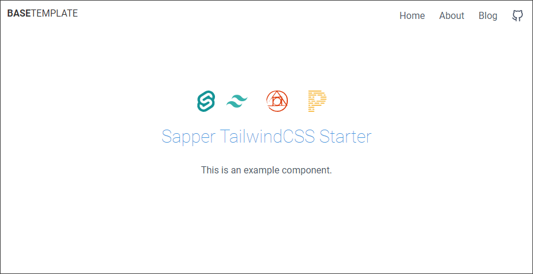

[](https://github.com/Christian-Rau/saptail-autoprefixer/network)
[](https://github.com/Christian-Rau/saptail-autoprefixer/network)
[](https://opensource.org/licenses/MIT)
[](https://github.com/Christian-Rau/saptail-autoprefixer/issues)

[](https://app.fossa.com/projects/git%2Bgithub.com%2FChristian-Rau%2Fsaptail-autoprefixer?ref=badge_small)

# saptail-autoprefixer
### *a SAPPER tailwindCSS base-template*
A modified default [Sapper](https://github.com/sveltejs/sapper) template, with [TailwindCSS](https://tailwindcss.com/), added is a simple navbar with hamburger-menu.
<p>
  <figure>
    
  </figure>
</p>

## Table of contents
* [General info](#general-info)
* [Technologies](#technologies)
* [Setup](#setup)
* [Structure](#structure)
* [Credits](#sources)

## General info
The purpose of this template is to form the basis for future projects developed in SAPPER. Since this is a base template, most of the CSS styling is removed, and the remaining CSS is re-written in TailwindCSS.

## Technologies
Project is created with:
* Sapper
* TailwindCSS
* PostCSS
* PurgeCSS
* Autoprefixer
* Prettier
* Live reloading / with ```npm run dev``` only

## Setup
```bash
# for Rollup with postcss, purgecss, cssnano, tailwindcss and svelte-preprocess
git clone https://github.com/Christian-Rau/saptail-autoprefixer.git my-app
```

### Running the project
However you get the code, you can install dependencies and run the project in development mode with:

```bash
cd my-app
npm install # or yarn
npm run dev
```

Open up [localhost:3000](http://localhost:3000) and start clicking around.

Consult [sapper.svelte.dev](https://sapper.svelte.dev) for help getting started.

## Structure

Sapper expects to find two directories in the root of your project — `src` and `static`.

### src

The [src](src) directory contains the entry points for your app — `client.js`, `server.js` and (optionally) a `service-worker.js` — along with a `template.html` file and a `routes` directory.

#### src/routes

This is the heart of your Sapper app. There are two kinds of routes — _pages_, and _server routes_.

**Pages** are Svelte components written in `.svelte` files. When a user first visits the application, they will be served a server-rendered version of the route in question, plus some JavaScript that 'hydrates' the page and initialises a client-side router. From that point forward, navigating to other pages is handled entirely on the client for a fast, app-like feel. (Sapper will preload and cache the code for these subsequent pages, so that navigation is instantaneous.)

**Server routes** are modules written in `.js` files, that export functions corresponding to HTTP methods. Each function receives Express `request` and `response` objects as arguments, plus a `next` function. This is useful for creating a JSON API, for example.

There are three simple rules for naming the files that define your routes:

- A file called `src/routes/about.svelte` corresponds to the `/about` route. A file called `src/routes/blog/[slug].svelte` corresponds to the `/blog/:slug` route, in which case `params.slug` is available to the route
- The file `src/routes/index.svelte` (or `src/routes/index.js`) corresponds to the root of your app. `src/routes/about/index.svelte` is treated the same as `src/routes/about.svelte`.
- Files and directories with a leading underscore do _not_ create routes. This allows you to colocate helper modules and components with the routes that depend on them — for example you could have a file called `src/routes/_helpers/datetime.js` and it would _not_ create a `/_helpers/datetime` route

### static

The [static](static) directory contains any static assets that should be available. These are served using [sirv](https://github.com/lukeed/sirv).

In your [service-worker.js](src/service-worker.js) file, you can import these as `files` from the generated manifest...

```js
import { files } from "@sapper/service-worker";
```

...so that you can cache them (though you can choose not to, for example if you don't want to cache very large files).

## Bundler config

Sapper uses Rollup or webpack to provide code-splitting and dynamic imports, as well as compiling your Svelte components. With webpack, it also provides hot module reloading. As long as you don't do anything daft, you can edit the configuration files to add whatever plugins you'd like.

## Production mode and deployment

To start a production version of your app, run `npm run build && npm start`. This will disable live reloading, and activate the appropriate bundler plugins.

You can deploy your application to any environment that supports Node 10 or above. As an example, to deploy to [Vercel Now](https://vercel.com) when using `sapper export`, run these commands:

```bash
npm install -g vercel
vercel
```

If your app can't be exported to a static site, you can use the [now-sapper](https://github.com/thgh/now-sapper) builder. You can find instructions on how to do so in its [README](https://github.com/thgh/now-sapper#basic-usage).

## Using external components

When using Svelte components installed from npm, such as [@sveltejs/svelte-virtual-list](https://github.com/sveltejs/svelte-virtual-list), Svelte needs the original component source (rather than any precompiled JavaScript that ships with the component). This allows the component to be rendered server-side, and also keeps your client-side app smaller.

Because of that, it's essential that the bundler doesn't treat the package as an _external dependency_. You can either modify the `external` option under `server` in [rollup.config.js](https://github.com/nhristov/sapper-template-rollup/blob/master/rollup.config.js) or the `externals` option in [webpack.config.js](https://github.com/sveltejs/sapper-template-webpack/blob/master/webpack.config.js), or simply install the package to `devDependencies` rather than `dependencies`, which will cause it to get bundled (and therefore compiled) with your app:

```bash
npm install -D @sveltejs/svelte-virtual-list
```

## Bugs and feedback

Sapper is in early development, and may have the odd rough edge here and there. Please be vocal over on the [Sapper issue tracker](https://github.com/sveltejs/sapper/issues).

## Sources
This template is based upon the [Nikola Hristov´s](https://github.com/nhristov/sapper-template-rollup) sapper-template-rollup
